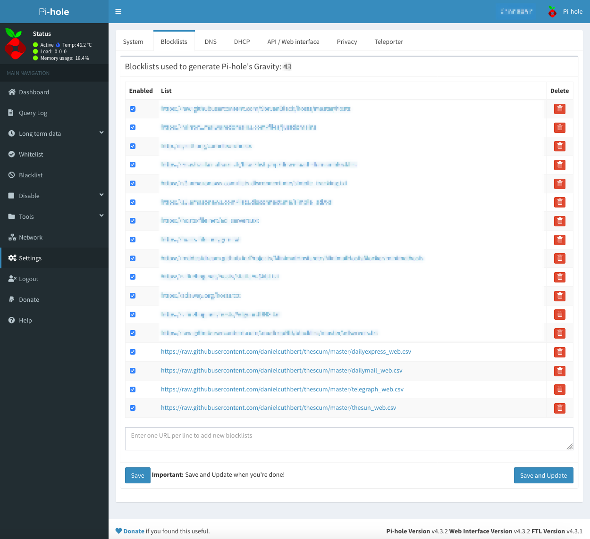

## What is this about?

What started out as a simple way to show how to mass block the sun and all that is evil about them, has quickly turned into a 'how do we block all who use the Internet to spread hatred and lies?'

This is about the infrastructure these publications use to spread their hate. The Domain Name System (DNS) and complex Content Delivery Networks (CDNs) that host and serve. 

As time permits, I'll continue to map and explore their vast networks so you can use the info to block them as you see fit. 

### Online presence

This is how The Sun newspaper looks on the Internet. Too often, the main domain name isn't the only entity, todays websites consists of many different sub-domains. In order to not see the content they serve, you need to understand all the pieces that make up the puzzle. 

For more information as to why, [this](https://www.vice.com/en_uk/article/gyzmzb/boycott-the-sun-ban-merseyside-uk) should help.

### Which publications do you currently have mapped?

- The Sun https://thesun.co.uk
- The Daily Mail https://dailymail.co.uk
- The Daily Express https://dailyexpress.co.uk
- The Telegraph https://telegraph.co.uk

### How do you use this information?

You can start by taking either the `$name__ips.csv` file and adding it to your hosts file on your computer. This will stop any access to any site the sun has. It's pretty simple to do. 

Under Microsoft Windows, follow this [guide](https://gist.github.com/zenorocha/18b10a14b2deb214dc4ce43a2d2e2992)

Under Mac OS X, follow this [guide](https://www.hostinger.co.uk/tutorials/how-to-edit-hosts-file-macos) 

### Using these blocklists with [Pi Hole](https://pi-hole.net/)

[Pi Hole](https://pi-hole.net/) is a network-wide Ad blocker for the [Raspberry Pi](https://www.raspberrypi.org/). You can use these lists with the Pi Hole quite easily, as follows:

In your Pi Hole Admin Panel (http://yourpihole/admin) browse to Settings and then Blacklists (see above). Then in the text box which states "Enter One URL per line to add new blocklists" add your disired blocklists separated by a carrage return, before clicking the _Save and Update_ button. You will need to use the `$name__web.csv` files with Pi Hole. For example to block The Daily Express, The Daily Mail, The Telegraph and The Sun you would enter:
`https://raw.githubusercontent.com/danielcuthbert/thescum/master/dailyexpress_web.csv`
`https://raw.githubusercontent.com/danielcuthbert/thescum/master/dailymail_web.csv`
`https://raw.githubusercontent.com/danielcuthbert/thescum/master/telegraph_web.csv`
`https://raw.githubusercontent.com/danielcuthbert/thescum/master/thesun_web.csv`

### Advanced usage

Sites like this need the support of the global ad and pervasive tracking network. In order to understand who support them, I've started to map who their partners are and this information can be found in the `$name_ips_expanded.csv` file. It's more of a work in progress. 
